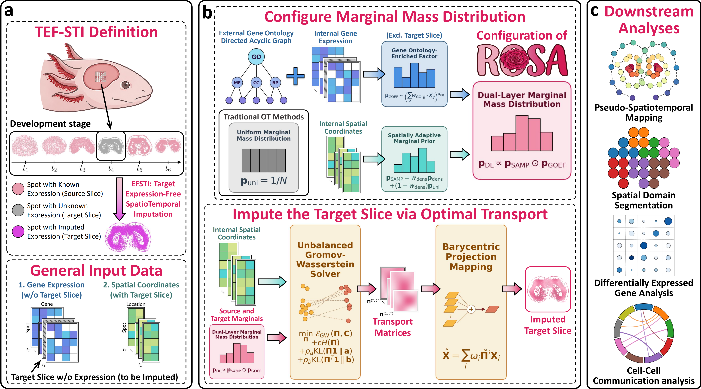

# ROSA: target expression-free spatiotemporal imputation via optimal transport


[](https://doi.org/10.5281/zenodo.22656109)

## 🌺 1. Method Description

ROSA is an optimal transport-based computational framework designed for Target Expression-Free SpatioTemporal Imputation (TEF-STI) during organogenesis.
Its Dual-Layer Marginal Mass Distribution (DLMMD) strategy dynamically calibrates unbalanced transport plans to impute missing transcriptome profiles using only target spatial coordinates.
Reconstructed profiles recover sharp spatial expression gradients and continuous developmental dynamics.
Featuring a lightweight mirror descent formulation, ROSA provides a fast, memory-efficient Python pipeline to bridge missing spatiotemporal transcriptomic sequences.



## 🛠️ 2. Installation Instructions

We strongly recommend installing ROSA within a dedicated `Conda` virtual environment to avoid dependency conflicts.
ROSA is fully developed and tested on `Python 3.10.20`.

💡 **NOTE:** Please ensure you have [Anaconda](https://www.anaconda.com/) or [Miniconda](https://docs.conda.io/en/latest/miniconda.html) installed on your system.

### 2.1. Clone the repository

First, clone the ROSA repository to your local machine and navigate into the project root directory:

```bash
git clone https://github.com/SundayChou/ROSA.git
cd ROSA
```

### 2.2. Option A: Install via environment.yml (Recommended)

The easiest way to set up the environment is to use the provided `environment.yml` file.
This will automatically create an environment named `rosa_env` with `Python 3.10.20` and install all required dependencies.
Finally, install ROSA in editable mode.

```bash
conda env create -f environment.yml -y
conda activate rosa_env
pip install -e .
```

💡 **NOTE:** The `pip install -e .` command installs ROSA in "editable" mode.
This maps the local source code to your Python environment, allowing you to use `import rosa` globally without moving the underlying files.

### 2.3. Option B: Install via requirements.txt (Alternative)

If you prefer to configure the environment manually using `pip`, you can create a fresh Conda environment, install the dependencies from `requirements.txt`, and then install ROSA:

```bash
conda create -n rosa_env python=3.10.20 -y
conda activate rosa_env
pip install -r requirements.txt
pip install -e .
```

### 2.4. Verification

Once the installation is complete, you can verify it by running a quick import test in your terminal:

```bash
python -c 'import rosa; print(f"rosa v{rosa.__version__} installed successfully!")'
```

## 📄 3. Tutorial Documents

We provide step-by-step Jupyter Notebook tutorials to demonstrate how to run ROSA to impute unmeasured target slices and perform downstream spatiotemporal analyses.

All tutorials are located in the `tutorials/` directory:

* `1_at_turorial.ipynb`: Experiments on the axolotl telencephalon dataset.
* `2_mb_tutorial.ipynb`: Experiments on the mouse brain dataset.

## 📂 4. File Acquisition

All required files for running ROSA (including benchmarking datasets and extrinsic biological priors) are publicly available.
You can **[CLICK HERE](https://drive.google.com/drive/folders/1UH3zQ2Z7dapg-lMl2ysGkw8g6L-SOqgO?usp=sharing)** to download all processed files.

💡 **NOTE:** The cloned repository already provides the empty folder structure.
To ensure the notebooks in the `tutorials/` folder run seamlessly, please place the downloaded files into their corresponding subdirectories within the `data/` folder.
The final directory structure should look as follows:

```text
data/
├── axolotl_telencephalon/
│   ├── 44.h5ad
│   ├── 54.h5ad
│   ├── 57.h5ad
│   ├── Adult.h5ad
│   ├── Juv.h5ad
│   └── Meta.h5ad
├── mouse_brain/
│   ├── E12.5.h5ad
│   ├── E13.5.h5ad
│   ├── E14.5.h5ad
│   ├── E15.5.h5ad
│   └── E16.5.h5ad
└── go-basic.obo
```

## 📬 5. Contact Information

Please contact us if you have any questions:
- Zhipeng Zhou (zhouzhp23@mail2.sysu.edu.cn);
- Jinyun Niu (niujy5@mail2.sysu.edu.cn);
- Yang Zhang (zhangy2569@mail2.sysu.edu.cn);
- Zhiming Dai **(Corresponding Author)** (daizhim@mail.sysu.edu.cn).

## ⚖️ 6. Copyright Information

Please see the `LICENSE` file for the copyright information.